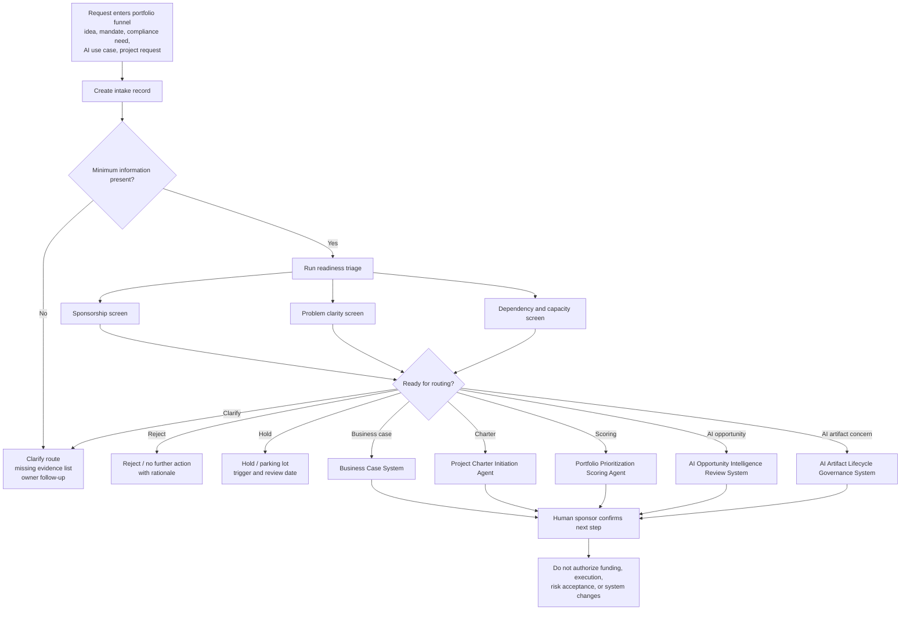

# Portfolio Intake Readiness Triage System

A human-governed intake triage system for classifying rough portfolio demand before it becomes false WIP, premature business cases, unready charters, or noisy portfolio backlog.

## Portfolio exhibit

| Review question | Where to look |
|---|---|
| Status | Public portfolio prototype for ChatGPT Project use and intake-readiness review. |
| Best evaluator | PMO, portfolio, program, strategy, or executive operations leaders who need cleaner demand before business case, charter, scoring, or delivery work begins. |
| Operating decision supported | Is this request ready to reject, hold, clarify, shape into a business case, move toward charter, route to portfolio scoring, or send to an AI governance path? |
| Concrete example | [`examples/sample-output.html`](examples/sample-output.html) shows a synthetic intake triage output with readiness classification and routing. |
| Before / after proof | Before: requests arrive as mandates, ideas, partial notes, or solution-first asks. After: each request has an intake record, readiness view, missing-evidence list, sponsorship signal, and recommended next route. |
| Boundary | This system classifies and routes demand. It does not build the business case, write the charter, score approved investments, authorize execution, assign resources, or accept risk. |
| Portfolio lane | [Triage intake readiness](https://policani.net/#navigator). |

## Operating problem

Portfolio work often enters governance too early, too vaguely, or without accountable sponsorship. A CFO may ask for a billing workflow fix, a CTO may request platform modernization, and a department lead may submit an AI automation idea. Each request may matter, but not every request is ready for the same next step.

This repository provides a lightweight executive operating aid for intake readiness. It helps a PMO, portfolio, program, strategy, or operations leader decide whether a request should be rejected, held, clarified, shaped into a business case, moved toward charter initiation, or prepared for portfolio scoring.

## Who it is for

- PMO, EPMO, portfolio, and program leaders
- Executive operators managing demand intake
- Business operations and technology governance teams
- Leaders who need cleaner demand before business case, charter, or prioritization work begins
- Teams using ChatGPT Projects for human-reviewed governance workflows

## What it does

- Captures a structured intake record from rough demand
- Tests whether the request has enough information to route
- Scores intake readiness across sponsorship, problem clarity, evidence, urgency, dependencies, and capacity signal
- Surfaces missing evidence and sponsorship gaps
- Classifies the request as **reject**, **hold**, **clarify**, **business case**, **charter**, or **portfolio scoring candidate**
- Provides explicit handoff instructions to adjacent modules

## What it does not do

- It does not build the business case
- It does not write the full project charter
- It does not score approved portfolio investments
- It does not authorize funding, execution, staffing, access, risk acceptance, or system changes
- It does not replace sponsor judgment or executive decision rights

## Installation and usage

### Use inside ChatGPT

1. Download or clone this repository.
2. Upload **only the `chatgpt-project/` folder** into a new ChatGPT Project.
3. Copy the contents of `AGENTS.md` into the ChatGPT Project instructions.
4. Start with `chatgpt-project/start-here.md`.
5. Use `chatgpt-project/sample-working-prompts.md` to run a triage session.
6. Keep source details public-safe, synthetic, scrubbed, or internally approved.

Do not upload the whole repository into ChatGPT unless you intentionally want examples and quality-review files included as reference material. The runtime is designed to work from the flat `chatgpt-project/` folder alone.

### Use the full repository locally or in Codex

Use the full repository when editing files, testing package completeness, reviewing examples, updating the Mermaid workflow, or preparing a GitHub release. The full repository includes examples, the workflow source, and the package quality review.

No configuration file is required. This package has no local dependencies, no build step, and no required runtime settings.

## Adjacent module fit

| Lifecycle layer | Repository/module | Relationship |
|---|---|---|
| AI idea review | AI Opportunity Intelligence Review System | Receives rough AI ideas when the core question is AI opportunity viability, proof, build/buy/wait, or governance control. |
| AI artifact governance | AI Artifact Lifecycle Governance System | Receives concerns about existing AI tools, agents, scripts, dashboards, or informal artifacts already in use. |
| Intake readiness | Portfolio Intake Readiness Triage System | Owns rough intake classification before business case, charter, or portfolio scoring work begins. |
| Business case | Business Case System | Receives items that need investment logic, options, assumptions, value case, financial reasoning, and decision review. |
| Project initiation | Project Charter Initiation Agent | Receives items with approved intent that need scope, objectives, ownership, governance rhythm, and planning handoff. |
| Portfolio scoring | Portfolio Prioritization Scoring Agent | Receives approved candidates that are ready for transparent prioritization, sequencing, and tradeoff review. |
| Governance operations | PMO Governance Operations Log | Receives active operating signals, meeting follow-up, decision logs, action registers, escalations, and carry-forward items. |

## Workflow



## Folder structure

```text
portfolio-intake-readiness-triage-system/
├── README.md
├── AGENTS.md
├── LICENSE.md
├── .gitignore
├── chatgpt-project/
│   ├── start-here.md
│   ├── operating-model.md
│   ├── trigger-map.md
│   ├── intake-record-template.md
│   ├── readiness-triage-rules.md
│   ├── sponsorship-screen.md
│   ├── problem-clarity-screen.md
│   ├── dependency-capacity-screen.md
│   ├── routing-rules.md
│   ├── output-templates.md
│   ├── handoff-rules.md
│   ├── sample-working-prompts.md
│   ├── quality-review-rubric.md
│   └── privacy-human-control.md
├── examples/
│   ├── sample-data.html
│   ├── sample-prompts.html
│   └── sample-output.html
├── workflow/
│   └── workflow.mmd
└── quality-review/
    └── package-test-results.html
```

## Runtime file count and constraints

- Runtime folder: `chatgpt-project/`
- Runtime structure: flat; no nested runtime folders
- Runtime files: 14
- Runtime cap: 25 files
- Configuration: absent; no user-editable configuration is required
- Data policy: use synthetic, scrubbed, or approved data only

## Primary outputs

1. Intake readiness record
2. Readiness score and classification
3. Sponsorship gaps
4. Missing evidence list
5. Dependency and capacity flags
6. Route recommendation
7. Downstream handoff packet
8. Human decision checklist

## Example locations

- Sample intake data: `examples/sample-data.html`
- Sample working prompts: `examples/sample-prompts.html`
- Sample triage output: `examples/sample-output.html`
- Mermaid workflow source: `workflow/workflow.mmd`
- Package review: `quality-review/package-test-results.html`

## Human-control statement

This module supports intake, classification, synthesis, routing, and decision preparation. Humans retain authority for approvals, funding, prioritization, sequencing, staffing, risk acceptance, compliance judgment, stakeholder communication, and execution. The system may recommend a route; it must not make the decision.

## Search keywords

portfolio intake, intake readiness, PMO intake, EPMO intake, portfolio governance, demand management, project intake, initiative triage, intake classification, sponsorship review, business case routing, project charter readiness, portfolio prioritization handoff, AI-assisted PMO, executive operating system, program governance, portfolio decision support, human-governed AI workflow.
